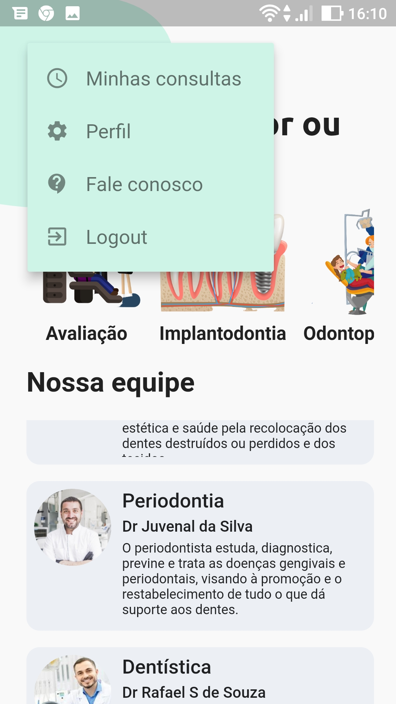

# Dental Care

This mobile app is part of the Dental Care appointment scheduling system. With it, the user can schedule and cancel appointments, change their personal data, such as username, email, password and dental plan data. User can also view scheduled appointments and appointment history.

This application uses as backend, an api developed with Node.js and a Postgres database.
 
 

### Thanks for the design:

[Kaushik Chandru ](https://www.youtube.com/user/kaushikchandru/featured)

## 📋 Features

- [x] New user creation page
- [x] Login page
- [x] Shows the dental specialties list
- [x] Clicking on a specialty opens the list of specialists
- [x] Shows the list with all the doctors
- [x] Clicking on the doctor opens the page of available times
- [x] Scheduling and canceling appointments
- [x] Shows scheduled appointments and appointment history
- [x] Profile page with editing name, email, password and dental plan
- [x] Logout button
       
       

## 🛠 Technologies

### The following tools were used in the construction of the project:

- [Flutter](https://flutter.dev/)
- [Modular](https://modular.flutterando.com.br/)
- [mobx](https://pub.dev/packages/mobx)
- [flutter_mobx](https://pub.dev/packages/flutter_mobx)
- [build_runner](https://pub.dev/packages/build_runner)
- [flutter_secure_storage](https://pub.dev/packages/flutter_secure_storage)
- [Dio](https://pub.dev/packages/dio)
- [Asuka](https://pub.dev/packages/asuka)
- [connectivity_plus](https://pub.dev/packages/connectivity_plus)
- [validatorless](https://pub.dev/packages/validatorless)
- [intl](https://pub.dev/packages/intl)
- [jwt_decoder](https://pub.dev/packages/jwt_decoder)
- [Clean Architeture](https://github.com/Flutterando/Clean-Dart)

 
 

## 📸 Screenshot of pages:

 

